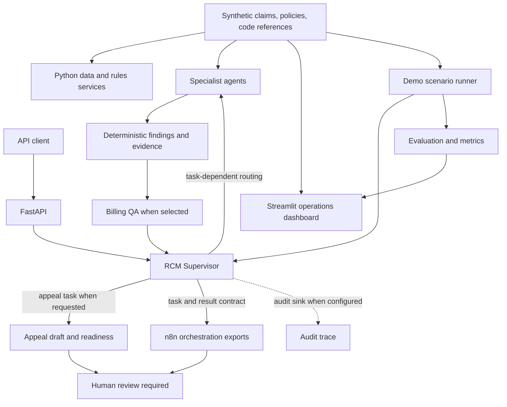
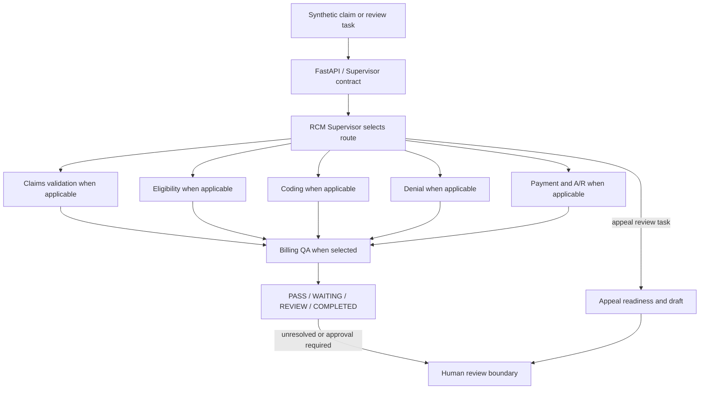
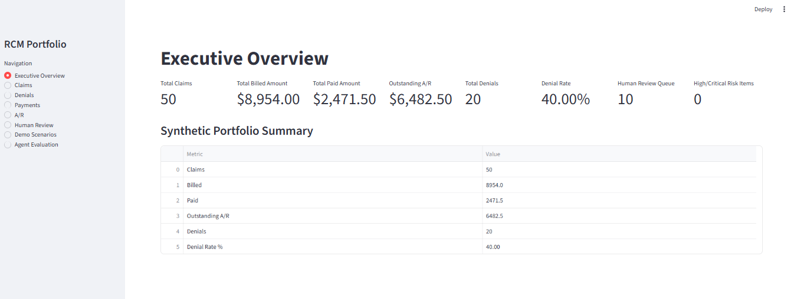
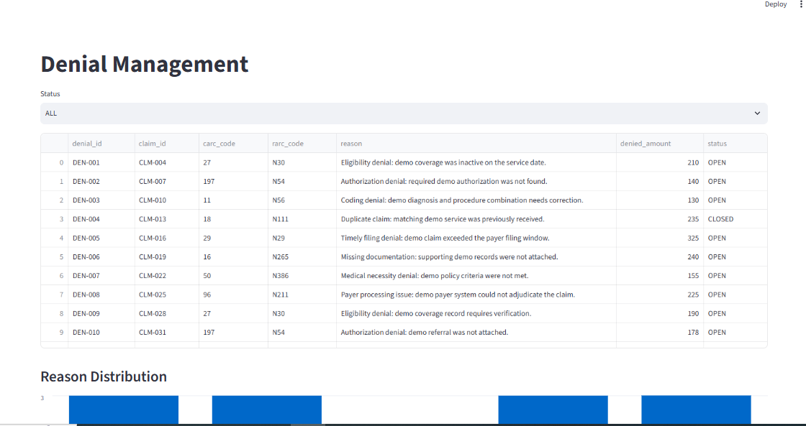
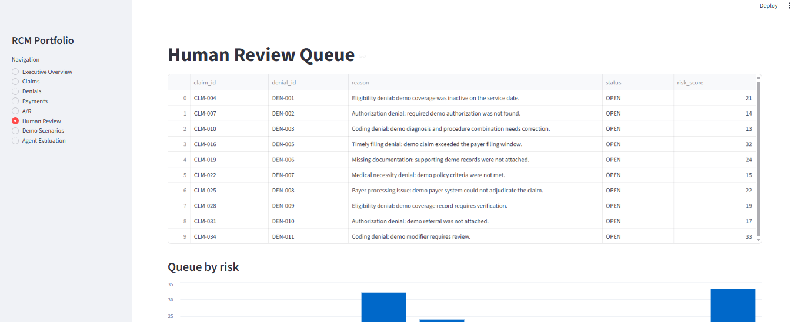
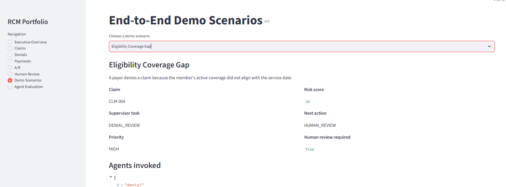
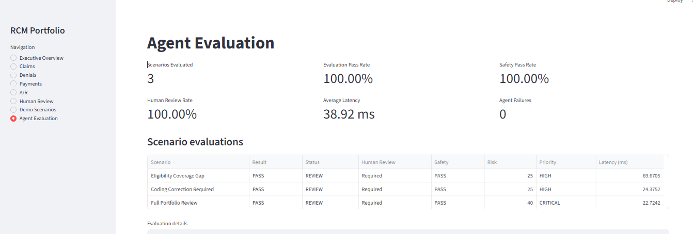

# AI-Powered Medical Billing RCM Multi-Agent System

An AI-assisted multi-agent Revenue Cycle Management portfolio system demonstrating deterministic billing validation, specialist-agent analysis, supervisor orchestration, human review, n8n workflow coordination, scenario evaluation, and operational dashboards using synthetic healthcare data.

> **Demo and safety notice:** Synthetic data only. This is not production healthcare software and makes no claim of clinical correctness, payer compliance, HIPAA compliance, or production readiness. No autonomous payer, claims, appeal, payment-posting, or eClinicalWorks action is implemented.

## Why This Project

The project explores how deterministic rules, specialized agents, explicit review states, and workflow orchestration can work together in a traceable RCM demo. It keeps business decisions in Python, exposes them through FastAPI, and makes outcomes reviewable through a Streamlit dashboard and a local evaluation harness.

## System Architecture



n8n validates, calls, and routes existing Python outcomes. It does not own RCM rules or make business decisions. The scenario runner uses the existing supervisor and specialists rather than a second implementation.

## Agent Architecture

| Component | Responsibility | Decision type | Human review trigger |
|---|---|---|---|
| Eligibility Agent | Checks synthetic member, payer, eligibility state, and coverage dates | Deterministic checks; optional explanation | Any non-pass or uncertain result |
| Claims Agent | Combines Rules Engine and Eligibility Agent findings | Deterministic validation and aggregation | Any non-pass result |
| Coding Agent | Validates synthetic ICD, CPT, and modifier references | Deterministic validation; optional explanation | Unknown, invalid, duplicate, unsupported, or failed coding checks |
| Denial Agent | Classifies documented denial evidence and checks available synthetic policy | Deterministic evidence/category analysis; optional recommendations | Unknown/conflicting evidence, unresolved policy, or judgment case |
| Payment Agent | Reconciles recorded financial components and classifies the available payment | Deterministic calculations; optional explanation | Missing, partial, zero, contradictory, or unresolved payment evidence |
| A/R Agent | Aggregates payment/denial context, balance, age, and work-queue priority | Deterministic aggregation and aging; optional explanation | Incomplete/conflicting evidence, unresolved context, or high risk |
| Billing QA Agent | Detects cross-agent identity, status, and financial inconsistencies | Deterministic cross-agent checks; optional explanation | Required evidence missing or a material QA conflict |
| Appeal Agent | Builds an evidence-based appeal draft and readiness result | Deterministic readiness/evidence; optional explanation | **Every result** requires human approval; nothing is submitted |
| RCM Supervisor | Selects routes, preserves results, aggregates risk, and records next state | Deterministic orchestration; optional explanation only | Failed/pending agents, specialist review flags, or other unresolved risk |

## Deterministic Rules and LLM Boundary

**Deterministic Python behavior** includes required-field and configured rule checks, synthetic eligibility/code/policy lookups, financial arithmetic and reconciliation, risk aggregation, A/R aging, route selection, status transitions, and Billing QA consistency checks.

**Optional LLM assistance** is limited to explanation, summarization, and recommendation drafting in agents that support an injected `LLMService`. The LLM is not required to run the local demo or tests. It cannot override the authoritative deterministic status, route, risk, priority, financial values, or evidence. The service is OpenAI-compatible, but no key is included or required by the default demo path.

## End-to-End Workflow



Routes are task-specific; the diagram does not mean every specialist runs for every case. A review result is a valid business outcome, not an HTTP error. Appeal preparation remains a draft/review step.

## Dashboard

Run the dashboard with:

```bash
python -m streamlit run dashboard/streamlit_app.py
```

Current pages: Executive Overview, Claims, Denials, Payments, A/R, Human Review, Demo Scenarios, and Agent Evaluation. The UI reads the synthetic repository dataset and evaluation results; it does not execute external billing actions. Screenshot guidance is in [docs/images/README.md](docs/images/README.md); no screenshots are included yet.

## Demo Scenarios

The scenario catalog in `app/services/demo_scenarios.py` currently contains three cases:

| Scenario | Purpose | Expected safe outcome | Human review? |
|---|---|---|---|
| Eligibility Coverage Gap (`CLM-004`) | Route an eligibility-related denial for evidence review | `REVIEW` | Yes |
| Coding Correction Required (`CLM-010`) | Route a coding-related denial through coding and QA review | `REVIEW` | Yes |
| Full Portfolio Review (`CLM-034`) | Exercise the full configured supervisor route | `REVIEW` | Yes |

These are synthetic walkthroughs, not representative clinical or payer determinations.

## Evaluation

Run the scenario evaluator with:

```bash
python scripts/evaluate_demo_scenarios.py
```

It compares observed supervisor outcomes with declared scenario expectations and reports scenario pass rate, safety pass rate, human-review rate, agent failures, and local execution latency. Latency is observational and does not decide pass/fail. The optional `--json` flag prints a machine-readable report. Details are in [docs/evaluation.md](docs/evaluation.md).

## n8n Orchestration

The repository includes three n8n workflow JSON exports: supervisor routing, denial-to-appeal human review, and a human-review gate. They call/route the Python contract and never submit claims or appeals, post payments, or communicate with payers. Validate them locally:

```bash
python scripts/validate_n8n_workflows.py
```

An n8n runtime is not required for the tests or static validation.

## API

Start FastAPI after initializing and seeding the local synthetic SQLite database:

```bash
python scripts/seed_data.py
python -m uvicorn app.main:app --reload
```

Swagger UI: `http://127.0.0.1:8000/docs`.

| Method | Endpoint | Purpose |
|---|---|---|
| `GET` | `/health` | Service health |
| `GET` | `/ready` | Application-level synthetic-demo readiness; does not check the database |
| `GET` | `/db/health` | Separately checks database connectivity |
| `POST` | `/rcm/supervisor` | Run a typed Supervisor task |
| `POST` | `/claims/{claim_id}/validate` | Claims validation |
| `POST` | `/claims/{claim_id}/eligibility` | Eligibility review |
| `POST` | `/claims/{claim_id}/coding` | Coding validation |
| `POST` | `/denials/{denial_id}/analyze` | Denial analysis |
| `POST` | `/payments/{payment_id}/analyze` | Payment analysis |
| `POST` | `/claims/{claim_id}/ar/analyze` | A/R analysis |
| `POST` | `/claims/{claim_id}/billing-qa` | Billing QA |
| `POST` | `/claims/{claim_id}/appeal` | Prepare appeal review draft |

## Human-in-the-Loop Safety


Uncertain eligibility/coding, unresolved denials, financial conflicts, Billing QA findings, failed/pending agents, risk signals, and appeal preparation can require review. External payer communication and any future claim/appeal submission or financial modification remain outside the system. No payer action is performed by this demo.

## Testing and CI


Run the local suite:

```bash
python -m pytest -q
```

Latest Step 20 local verification snapshot: **228 tests passed, 1 upstream warning**. This is a snapshot, not a fixed CI test-count requirement.

GitHub Actions is configured for pushes and pull requests. Its workflow installs dependencies, checks imports/project structure, validates n8n exports, evaluates the synthetic scenarios, and runs pytest. The workflow file was syntax-checked locally; this README does not claim a successful GitHub-hosted run.

## Quick Start

Create and activate a virtual environment, then install and test:

```powershell
python -m venv .venv
.venv\Scripts\Activate.ps1
python -m pip install -r requirements.txt
python -m pytest -q
```

In Command Prompt, activate with `.venv\Scripts\activate.bat`; on macOS/Linux use `source .venv/bin/activate`. Optional OpenAI configuration is blank by default. Local database default is SQLite; the seed command loads only synthetic data. Compose's optional Postgres service requires `POSTGRES_PASSWORD` to be set locally.

Other project checks:

```bash
python scripts/check_project.py
python scripts/check_docs.py
python scripts/validate_n8n_workflows.py
python scripts/evaluate_demo_scenarios.py
python -m uvicorn app.main:app --reload
python -m streamlit run dashboard/streamlit_app.py
```

## Project Structure


```text
app/
  agents/       specialist agents and RCM Supervisor
  services/     deterministic services and demo scenario runner
  evaluation/   evaluation schema, comparisons, and metrics
  models/       persistence models
  schemas/      API and agent contracts
dashboard/      Streamlit operations and evaluation UI
workflows/n8n/  orchestration exports and examples
data/           synthetic demo records and rule references
scripts/        validation, seed, and evaluation commands
tests/          agent, API, evaluation, and dashboard tests
docs/           architecture, operations, and portfolio guidance
.github/workflows/  GitHub Actions CI
```

## Technology Stack


Python, FastAPI, Pydantic/Pydantic Settings, SQLAlchemy, SQLite by default (optional PostgreSQL via Compose), Streamlit, pandas, pytest, n8n workflow exports, and an optional OpenAI-compatible LLM service.

## Limitations and Future Production Considerations

All records, code references, and payer policies are synthetic and incomplete. The project does not establish clinical correctness, coding advice, payer compliance, HIPAA compliance, or production readiness. It has no production authentication, real payer/eClinicalWorks/clearinghouse integration, external action execution, or production monitoring. A production system would require validated authoritative sources, privacy/security and access controls, qualified human workflows, integration testing, operational controls, and a separate compliance review.

No `LICENSE` file is present. The repository owner should choose a license before public release. See [docs/portfolio_talking_points.md](docs/portfolio_talking_points.md), [docs/demo_guide.md](docs/demo_guide.md), [docs/release_checklist.md](docs/release_checklist.md), [CONTRIBUTING.md](CONTRIBUTING.md), and [SECURITY.md](SECURITY.md).
# AI-Powered Medical Billing RCM Multi-Agent System

A Python/FastAPI multi-agent revenue-cycle-management demo using synthetic data only. Python specialist agents and the RCM Supervisor remain authoritative for business decisions. n8n exports demonstrate orchestration contracts; the Streamlit dashboard presents synthetic operations and evaluation results.

## Structure

```text
.
├── app/
│   ├── agents/
│   ├── schemas/
│   └── services/
├── dashboard/
│   └── streamlit_app.py
├── data/
├── docs/
├── scripts/
├── tests/
├── workflows/n8n/
├── .env.example
└── requirements.txt
```

## Quick Start

```bash
python -m venv .venv
```

Activate the environment with `.venv\Scripts\Activate.ps1` in PowerShell or `source .venv/bin/activate` on macOS/Linux. Then install and test:

```bash
python -m pip install -r requirements.txt
python -m pytest -q
```

Copy `.env.example` to `.env` only when local configuration is needed; its OpenAI key remains blank. Local default database mode uses SQLite. Use synthetic records only; do not add real patient or payer data.

## Run Locally

FastAPI:

```bash
python scripts/seed_data.py
python -m uvicorn app.main:app --reload
```

Dashboard:

```bash
python -m streamlit run dashboard/streamlit_app.py
```

Evaluate scenarios:

```bash
python scripts/evaluate_demo_scenarios.py
```

Validate n8n workflow exports:

```bash
python scripts/validate_n8n_workflows.py
```

The dashboard includes the Agent Evaluation page. See [docs/evaluation.md](docs/evaluation.md) and [docs/deployment_readiness.md](docs/deployment_readiness.md) for evaluation and CI details.
## Dashboard Preview

The Streamlit operations dashboard provides a visual interface for exploring the synthetic RCM workflow, human-review cases, demo scenarios, and agent evaluation results.

### Executive Overview



### Denial Management



### Human Review Queue



### End-to-End Demo Scenarios



### Agent Evaluation



> **Demo notice:** All dashboard data is synthetic. The project does not perform real claim submission, payment posting, appeal submission, or external payer actions.