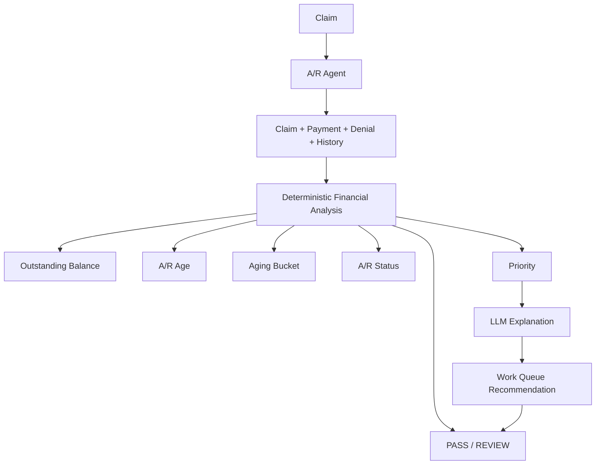

# A/R Specialist Agent

The A/R Agent analyzes the receivable associated with a synthetic claim. It aggregates deterministic Payment Agent, Denial Agent, claim, history, payer-policy, and aging evidence to prioritize investigation. It does not contact payers, alter records, write off balances, send collections communication, rebill, or submit appeals.



## Deterministic financial analysis

The A/R Agent consumes the Payment Agent result rather than duplicating payment calculations. When available, it preserves the Payment Agent's billed amount, paid amount, adjustment amount, unpaid balance, payment classification, reconciliation findings, and status. Missing payment evidence produces `INCOMPLETE`; no amount is silently invented.

The authoritative balance is:

```text
billed amount - paid amount - adjustment amount
```

Decimal values are used throughout. `OPEN` means the available data indicates a positive balance; it does not establish that a payer owes money. `RESOLVED` means the deterministic balance is zero. The overall result status is `PASS` or `REVIEW`, and `PASS` does not mean collectible, contractually correct, or payable.

## Age and aging buckets

A/R age is calculated from claim `service_date` to the injected current date using whole calendar days. Future service dates are retained as invalid and produce `REVIEW`; they are never normalized.

Inclusive boundaries are:

- `0-30`: `CURRENT_0_30`
- `31-60`: `DAYS_31_60`
- `61-90`: `DAYS_61_90`
- `91-120`: `DAYS_91_120`
- `121-180`: `DAYS_121_180`
- `181-365`: `DAYS_181_365`
- `366+`: `DAYS_366_PLUS`

## Payment, denial, history, and policy integration

Payment Agent classifications and evidence remain authoritative for payment context. Denial Agent category, status, review state, and evidence remain authoritative for denial context; the A/R Agent does not replace a denial category. Claim history is summarized with source attribution and no intent is inferred. Existing synthetic payer policies are reused. Missing policy is reported as `UNKNOWN` and is review-relevant when it affects analysis.

## Priority and work queue

Priority uses `data/ar_policy.json`, explicitly labeled synthetic/demo policy. Current demo thresholds are age and balance thresholds for low, medium, high, and critical workflow priority. They are not industry standards or payer rules. Every priority includes reasons such as age, balance, denial review, or payment classification.

Work-queue suggestions are deterministic only:

- denial categories route to denial, eligibility, coding, or documentation review
- partial, zero, underpayment, and overpayment route to payment investigation
- incomplete financial data routes to human financial review
- otherwise the result is `NO_ACTION`

These are suggestions only; no action is executed automatically.

## LLM boundary and human review

The LLM receives deterministic A/R evidence and may explain the balance, age, bucket, priority, and suggested work type. It cannot change the authoritative balance, age, bucket, priority, risk score, payment classification, denial category, payer policy, or financial records. LLM output is never stored as authoritative evidence.

Human review is required for incomplete or contradictory evidence, future dates, unresolved denial/payment conditions, high-risk priority, policy uncertainty, financial responsibility questions, or any action that would modify records or communicate externally.

## Risk and audit

Risk uses the shared deterministic convention: `CRITICAL=40`, `HIGH=25`, `MEDIUM=15`, `LOW=5`, capped at 100. Issue rules are de-duplicated before scoring. This is a workflow-risk indicator, not recovery, collection, payment, legal-liability, or appeal-success probability.

Audit events include:

- `ar_check_started`
- `ar_claim_loaded`
- `ar_payment_evidence_collected`
- `ar_denial_evidence_collected`
- `ar_history_checked`
- `ar_policy_checked`
- `ar_balance_calculated`
- `ar_age_calculated`
- `ar_aging_bucket_assigned`
- `ar_priority_assigned`
- `ar_work_queue_recommendation_generated`
- `ar_root_cause_analyzed`
- `ar_llm_reasoning` when used
- `ar_result_generated`

Audit details contain claim ID, status, and synthetic source only. They do not contain full patient records, member IDs, secrets, or API keys.

## Testing and limitations

Tests inject a fixed current date and deterministic fake collaborators. They require no PostgreSQL, Docker, network, API key, eClinicalWorks, payer API, clearinghouse, or production integration.

All healthcare data and payer policies in this project are synthetic/demo data. The A/R thresholds are demo configuration, not real standards. This is not a production billing system and makes no HIPAA compliance claim. Production deployment would require appropriate privacy, security, authorization, financial controls, auditability, validated integrations, and compliance review.
