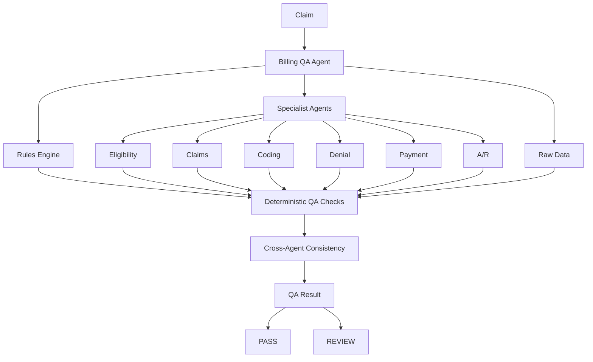

# Billing QA Specialist Agent

The Billing QA Agent is a deterministic cross-agent consistency and quality-control layer. It consumes existing specialist results and raw synthetic records to detect missing evidence, identity mismatches, financial contradictions, and status conflicts. It is not an independent adjudicator and does not replace any specialist or the Rules Engine.



## QA philosophy and source hierarchy

The agent verifies existing results rather than creating a new billing source of truth:

```text
Raw deterministic record
        -> deterministic specialist calculation
        -> cross-agent derived result
        -> LLM explanation
```

Raw records and deterministic specialist outputs remain authoritative for their domains. Billing QA preserves conflicts for human review; it does not choose which conflicting value is correct. LLM output is never authoritative billing evidence.

## Domains and checks

Billing QA can check claim identity and payer identity, Rules Engine versus Claims Agent status, Eligibility versus Claims eligibility, Coding values against claim codes, Denial category against A/R context, Payment values/classification/balance against A/R, A/R aging against the injected current date, claim history availability, and payer-policy availability when supplied.

Missing optional results are not automatically failures. The `expected_agents` dependency allows a workflow to declare which results are required. A missing declared result becomes `MISSING_AGENT_RESULT` and `REVIEW`; an absent optional denial can remain not applicable.

## Status, priority, and risk

- `PASS`: no material deterministic inconsistency was detected in available evidence.
- `REVIEW`: evidence is missing where required, identities conflict, specialist results disagree, financial values conflict, or another material QA issue needs human investigation.

`PASS` does not mean the claim is correct, payable, medically valid, collectible, or HIPAA compliant.

QA priority is the highest issue severity: `CRITICAL`, `HIGH`, `MEDIUM`, or `LOW`. Risk uses the shared weights `CRITICAL=40`, `HIGH=25`, `MEDIUM=15`, and `LOW=5`, capped at 100. Duplicate observations of the same issue type are scored once.

## Evidence model

Every issue and result includes source-attributed evidence. Sources include `claim_record`, `rules_engine`, `eligibility_agent`, `claims_agent`, `coding_agent`, `denial_agent`, `payment_agent`, `ar_agent`, `payment_record`, `denial_record`, `claim_history`, and `payer_policy`. Evidence contains field/value context without full patient records, member IDs, secrets, or API keys.

## LLM boundary and human review

The LLM may summarize deterministic QA findings, explain a contradiction, and draft recommendations. It cannot resolve conflicts, select the correct payer, change financial values, alter coding, eligibility, denial category, payment classification, A/R aging, QA status, or priority, or hide missing evidence. Human review is required for every `REVIEW` result and any potential claim or financial modification.

## Audit events

The injectable audit sink receives concise events:

- `billing_qa_check_started`
- `billing_qa_claim_loaded`
- `billing_qa_rules_checked`
- `billing_qa_eligibility_checked`
- `billing_qa_claims_checked`
- `billing_qa_coding_checked`
- `billing_qa_denial_checked`
- `billing_qa_payment_checked`
- `billing_qa_ar_checked`
- `billing_qa_cross_agent_checks_completed`
- `billing_qa_conflicts_detected`
- `billing_qa_llm_reasoning` when used
- `billing_qa_result_generated`

## Testing and limitations

Tests use deterministic dictionaries and fake collaborators. They require no network, OpenAI API key, PostgreSQL, Docker, eClinicalWorks, payer API, clearinghouse, or automatic mutation capability.

All healthcare data and payer policies are synthetic/demo data. This project does not claim HIPAA compliance, production healthcare deployment, real payer integration, clinical validation, or production medical billing accuracy. Production use would require validated integrations, privacy/security controls, authorization, audit retention, and qualified human review.
