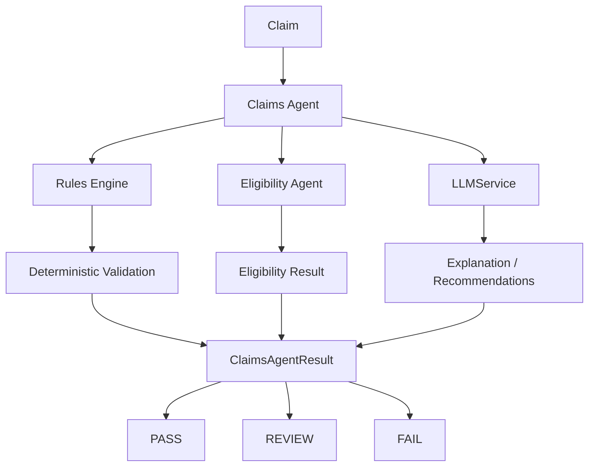

# Claims Specialist Agent

The Claims Specialist Agent is a claim-level pre-submission readiness orchestrator. It combines the existing deterministic Rules Engine with the existing Eligibility Agent and optionally asks the domain-agnostic `LLMService` to explain documented findings.

## Responsibilities and dependency injection

`ClaimsAgent` accepts injectable claim and patient lookups, Rules Engine, Eligibility Agent, LLM service, and audit sink. It can run by claim ID with `run(claim_id)` or directly validate a claim object with `validate_claim(claim, patient)`.

The production API route uses the existing SQLAlchemy session only to provide lookup functions. Unit tests use plain synthetic dictionaries and fakes, so they do not require PostgreSQL.

## Source-of-truth boundaries

- **Rules Engine** = source of truth for deterministic claim validation.
- **Eligibility Agent** = source of truth for eligibility verification.
- **Claims Agent** = orchestration and aggregation layer.
- **LLM** = explanation and recommendation only.

The Claims Agent preserves the Rules Engine status, issues, passed/failed rules, warnings, and risk score. It does not duplicate rule logic or allow an LLM response to change deterministic status.

## Status aggregation

- `PASS`: Rules Engine and Eligibility Agent both pass, with no unresolved issues.
- `REVIEW`: eligibility review, warnings, unknown payer policy, incomplete information, or other non-fatal uncertainty.
- `FAIL`: Rules Engine failure, eligibility failure, missing essential claim data, invalid amount/codes, critical validation failure, or clearly invalid coverage findings.

The Claims Agent reuses the Rules Engine risk score and does not add a second score or double-count issues. Any non-pass status requires human review.

## LLM use and recommendations

The LLM receives only the claim ID, deterministic Rules Engine status/findings, eligibility status, aggregated status, and issue messages. It may summarize these facts and produce recommendations. It must not invent ICD/CPT codes, payer policies, authorization, eligibility, coverage, medical necessity, or claim values. If no LLM is configured, deterministic explanations and recommendations are returned.

Recommendations are tied to observed issues, for example:

- missing CPT: verify and add the appropriate CPT code before submission
- payer mismatch: verify patient payer information against the claim
- eligibility issue: verify active coverage and payer/member information
- timely filing issue: review synthetic timely-filing requirements and determine whether an exception or correction is appropriate

## Audit events

The injectable audit sink receives concise synthetic-source events:

- `claims_check_started`
- `claim_loaded`
- `claim_rules_validated`
- `claim_eligibility_checked`
- `claims_llm_reasoning` when used
- `claims_result_generated`

Events contain claim ID, status, and source only. They do not include full patient records, unnecessary member IDs, API keys, or secrets.

## Testing and limitations

Tests use deterministic fake Rules Engine, Eligibility Agent, LLM, and audit sink implementations. They make no network calls and require no API key, PostgreSQL, Docker, payer API, eClinicalWorks integration, or authentication system.

This is a synthetic portfolio/demo implementation and makes no HIPAA compliance claim. A future eClinicalWorks or payer integration would require separate authentication, privacy, access control, auditing, error handling, and compliance design. No real PHI or real claims submission is supported.
