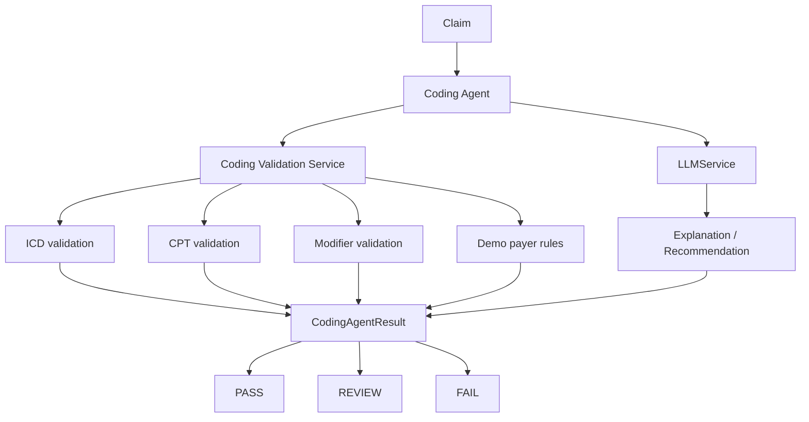

# Coding Specialist Agent

The Coding Specialist Agent performs deterministic validation of synthetic ICD, CPT, and modifier values, then optionally uses the existing `LLMService` to explain documented findings. It is a structured review tool, not a clinical coding decision-maker.

## Architecture and dependency injection

`CodingValidationService.validate_claim_codes(claim)` is the deterministic source of coding findings. `CodingAgent` orchestrates that service and accepts injectable claim lookup, patient lookup, validation service, LLM service, and audit sink dependencies. `run(claim_id)` loads a claim through the injected lookup; `validate_coding(claim)` accepts a claim object directly.

The agent does not modify claims and does not require a database for unit tests.

## Deterministic validation

- ICD values must be non-empty strings, match the configured demo format, appear in the small synthetic ICD reference, and not be duplicated.
- CPT values must be non-empty strings, match the configured five-digit demo format, appear in the small synthetic CPT reference, and not be duplicated.
- Modifiers are normalized, checked for empty or malformed values, duplicates, configured support, and explicitly configured synthetic payer modifier rules.

Unknown reference values produce `UNKNOWN_CODE` and `REVIEW`; invalid structure or missing required code lists produce a high-severity `FAIL`. Duplicate codes, unsupported modifiers, and configured payer-rule issues produce `REVIEW`.

The references under `data/` are explicitly synthetic demonstration data. They are small, incomplete, and not suitable for real medical billing.

## Status and risk

- `PASS`: all configured coding checks pass.
- `REVIEW`: unknown code, duplicate code, unsupported modifier, or non-fatal configured rule issue.
- `FAIL`: missing code, invalid format, or another high/critical deterministic coding issue.

Risk scoring reuses the established deterministic severity convention without involving an LLM: `CRITICAL=40`, `HIGH=25`, `MEDIUM=15`, and `LOW=5`, capped at 100. Coding score is specific to coding findings and is not a replacement for the overall Rules Engine score.

## LLM boundary

The LLM receives deterministic coding findings only and may summarize them or recommend qualified human review. It must not determine or invent diagnoses, medical necessity, ICD codes, CPT codes, modifiers, payer policy, authorization, or clinical facts. Its explanation cannot change the deterministic status, and invented codes from its response are never added to the result or claim.

This project does not provide clinical coding advice and does not replace a qualified medical coder.

## Human review and audit

All `REVIEW` and `FAIL` results set `requires_human_review=true`. Clean deterministic `PASS` results do not require review.

Audit events are concise and synthetic-source tagged:

- `coding_check_started`
- `coding_claim_loaded`
- `icd_codes_validated`
- `cpt_codes_validated`
- `modifiers_validated`
- `coding_llm_reasoning` when used
- `coding_result_generated`

They contain claim ID, status, and source only, not full patient records, member IDs, secrets, or API keys.

## Testing and production limitations

Tests use synthetic claims and deterministic fake services, with no API key, network request, PostgreSQL, Docker, payer API, eClinicalWorks integration, or authentication requirement.

A real production system would require authoritative and properly licensed coding references, payer-specific rules, qualified coding review, security controls, privacy controls, audit controls, and compliance design. This portfolio project uses synthetic data only and makes no HIPAA compliance claim.
