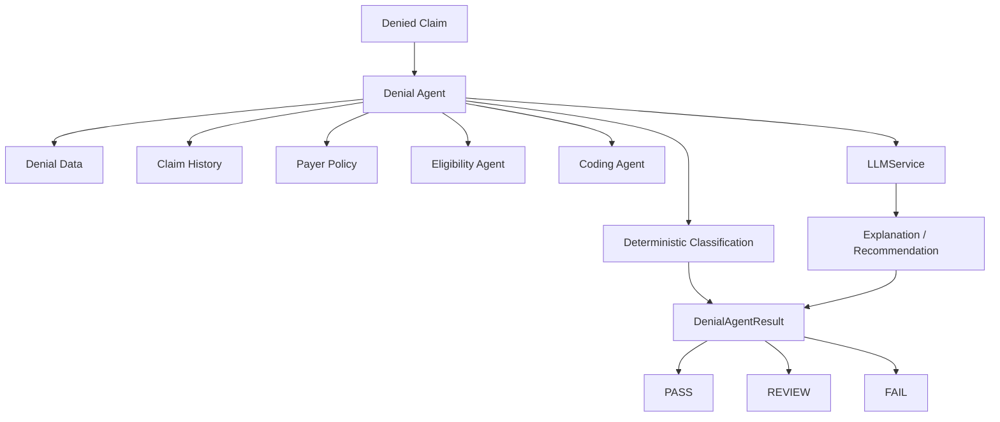

# Denial Specialist Agent

The Denial Specialist Agent analyzes an existing synthetic denied claim using documented denial facts, claim history, synthetic payer policy, and optional deterministic outputs from the Eligibility and Coding Agents. It produces traceable evidence, a category, a status, and a human-review recommendation.

## Deterministic evidence and categories

The agent first uses the synthetic CARC/RARC mapping in `data/denial_codes.json` and explicit denial-reason phrases. Supported categories are `ELIGIBILITY`, `AUTHORIZATION`, `CODING`, `MEDICAL_NECESSITY`, `DUPLICATE`, `TIMELY_FILING`, `MISSING_DOCUMENTATION`, `COORDINATION_OF_BENEFITS`, `PAYER_PROCESSING`, and `UNKNOWN`.

CARC/RARC values and denial reasons are preserved as documented facts. The small mapping is synthetic and incomplete; it is not an official or complete CARC/RARC reference. Unknown codes remain unmapped. A mapped code that conflicts with the documented reason produces `UNKNOWN` and `REVIEW` rather than choosing silently.

Evidence records contain a type, source, finding, and concise details. Sources include synthetic denial data, the synthetic code reference, synthetic payer policy, synthetic claim history, synthetic claim data, Eligibility Agent, and Coding Agent.

## Payer policy and claim history

The existing `data/payer_policies.json` file is used when the denial category concerns authorization, timely filing, documentation, or payer processing. Missing policy is represented as `policy_status=UNKNOWN` and causes review; no payer rule is invented.

An injected claim-history lookup can provide related synthetic records. The agent records only a count and source attribution, not full history contents.

## Status and risk

- `PASS`: the deterministic denial category and documented evidence are resolved for this demo analysis. This does not mean the claim should be paid.
- `REVIEW`: unknown or conflicting evidence, missing policy/claim data, medical necessity, payer processing, or another human-judgment condition.
- `FAIL`: reserved for a future explicit critical processing failure; this implementation does not use it to claim that a payer is wrong.

Risk uses the shared deterministic severity convention: `CRITICAL=40`, `HIGH=25`, `MEDIUM=15`, `LOW=5`, capped at 100. It is not a probability of payment or appeal success.

## LLM boundary and human review

The LLM receives only the deterministic category, status, evidence, and issues. It may explain the supplied evidence and draft recommendations or missing-information prompts. It cannot change the category/status, invent CARC/RARC meanings, payer policies, eligibility, coding facts, clinical facts, or appeal outcomes. It cannot submit an appeal or resubmit a claim.

Human review is required for `REVIEW` and `FAIL`, unknown/conflicting codes, medical necessity, payer processing disputes, potential appeals, and any external payer communication. The future Appeal Agent will handle controlled appeal workflows.

## Audit events

The injectable audit sink receives:

- `denial_check_started`
- `denial_loaded`
- `denial_codes_evaluated`
- `denial_evidence_collected`
- `denial_policy_checked`
- `denial_root_cause_analyzed`
- `denial_llm_reasoning` when used
- `denial_result_generated`

Audit details contain only denial ID, status, and synthetic source. They do not contain API keys, secrets, full patient records, member IDs, or unnecessary PHI.

## Safety and limitations

This is a portfolio demonstration using synthetic healthcare data. It does not claim real payer behavior, medical necessity determination, payment probability, appeal success, production billing accuracy, or HIPAA compliance. A production system would need authoritative/licensed code references, payer integrations, privacy and access controls, audit retention, and qualified human review.

The architecture demonstrates deterministic evidence, agent orchestration, LLM-assisted explanation, human-in-the-loop controls, and auditability. It does not implement real payer APIs, eClinicalWorks, clearinghouse communication, automatic resubmission, or automatic appeal submission.
