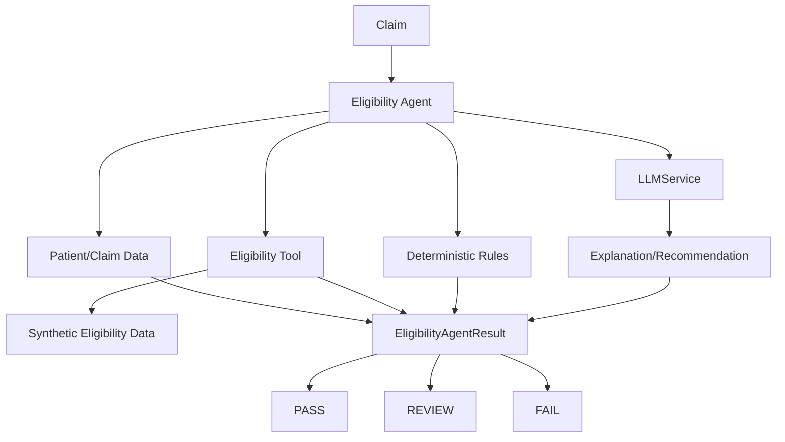

# Eligibility Specialist Agent

The Eligibility Specialist Agent coordinates a synthetic eligibility lookup, deterministic checks, and optional LLM explanation. It does not call payer APIs, eClinicalWorks, or external eligibility services.

## Eligibility tool

`EligibilityTool.check_eligibility(patient_id, payer, member_id)` reads `data/eligibility.json`, a clearly synthetic dataset. It returns controlled `ELIGIBLE`, `INELIGIBLE`, or `UNKNOWN` states and only facts present in that file. Unknown patients, payer/member combinations, or missing member IDs remain unknown; the tool never fabricates coverage dates or benefits.

## Deterministic rules

The agent checks:

- patient existence
- claim and patient payer presence
- member ID presence
- eligibility state from the tool
- coverage date availability
- service date within inclusive coverage boundaries
- claim payer versus patient payer mismatch

Coverage outside the recorded dates is `FAIL`. Ineligible, unknown, missing, or contradictory information is `REVIEW`, except a missing patient is an immediate `FAIL`. Human review is required for every non-pass result.

**Deterministic code determines eligibility facts. LLM explains and reasons over those facts.**

## LLM responsibilities

The agent uses the existing `LLMService` only when deterministic findings need explanation. It sends synthetic status, dates, payer labels, overall status, and issue messages. The LLM may produce an explanation and recommendation, but it cannot determine raw eligibility or invent coverage, benefits, authorization, copays, deductibles, payer responses, or member status. If no LLM is injected, a deterministic fallback explanation is returned.

## Audit logging

An injectable audit sink records these events:

- `eligibility_check_started`
- `eligibility_tool_called`
- `eligibility_rules_evaluated`
- `eligibility_llm_reasoning` when used
- `eligibility_result_generated`

Audit details contain only claim ID, status, and synthetic source metadata. Full patient records, member IDs, and secrets are not logged.

## Testing and limitations

Tests inject plain Python claims, patients, a fake LLM, and an in-memory event sink. They require no API key, network, PostgreSQL, Docker, payer API, or eClinicalWorks integration.

This is a portfolio/demo implementation using synthetic records only. A future real payer or eClinicalWorks adapter would need separate authentication, timeout, privacy, access control, audit, error-handling, and compliance design. This project makes no HIPAA compliance claim.
