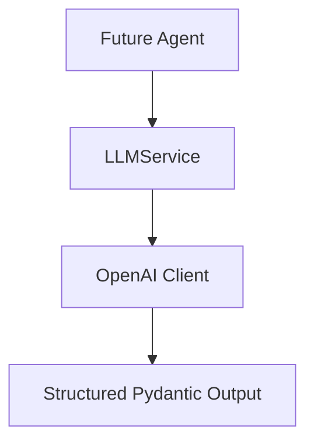

# Reusable LLM Service

`LLMService` is a domain-agnostic adapter around the official OpenAI Python SDK. It gives future agents one place to request text or structured Pydantic output without putting RCM business rules, payer logic, or PHI handling into the client integration.



## Architecture role

- **Rules Engine** = deterministic validation and risk checks.
- **LLM Service** = reasoning, extraction, classification, and generation.
- **Future Agents** = business workflow orchestration.

The LLM service does not replace deterministic billing validation. Future agents can consume both a rules-engine result and an LLM response, but deterministic rules remain explicit and auditable.

## Configuration

The service reads `OPENAI_API_KEY` and `OPENAI_MODEL` from the existing `app.config.settings` object. A centralized default model is used when `OPENAI_MODEL` is empty. API keys are never included in logs, exceptions, or response schemas.

Production setup should use a secret manager or protected environment configuration. This demo intentionally contains no real API key and no real patient data.

## Interface

```python
from app.services.llm_service import LLMService

service = LLMService()
text_result = service.generate(
    system_instructions="Be concise.",
    user_prompt="Summarize this synthetic input.",
)
structured_result = service.generate_structured(
    user_prompt="Classify this synthetic input.",
    response_model=SomePydanticModel,
)
```

`LLMResponse` includes the model name, validated response, optional explicitly supplied confidence, usage metadata, request ID, and processing time. The service does not invent confidence values.

## Error handling and retries

The service raises application-facing exceptions for missing configuration, timeout, connection, rate-limit, malformed response, and structured-output validation failures. Timeout, connection, and rate-limit failures receive a finite configurable retry count. Authentication, invalid-request, and schema/configuration failures are not retried blindly.

Error messages are deliberately safe and do not include provider exception text that could contain credentials or sensitive request data.

## Testing

Tests inject an OpenAI-compatible fake client. They use deterministic responses and do not require an API key, internet access, PostgreSQL, Docker, n8n, or a live OpenAI request. The production client is created lazily, so importing the service does not make a network call.

## Healthcare safety

This is a synthetic portfolio demo, not a HIPAA compliance claim. A production healthcare deployment would need appropriate privacy, access control, audit, retention, encryption, vendor, and compliance controls. Do not send real PHI to this demo service.
