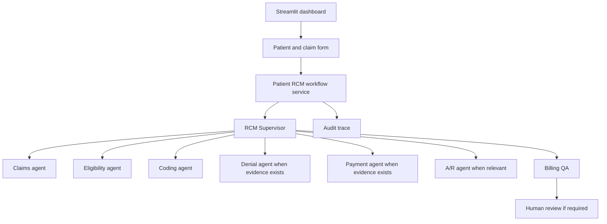

# Patient RCM Workflow

## Purpose

The interactive Patient RCM Workflow is a synthetic, demo-only dashboard flow for creating a patient and claim, running the deterministic RCM stack, and reviewing the resulting evidence without submitting anything externally.

It is designed to show the supervisory orchestration boundary clearly: the dashboard presents the workflow, while the Python agents remain authoritative for status, risk, priority, and evidence.

## Architecture



The workflow service adapts in-memory synthetic inputs to the existing Python agents instead of duplicating billing rules in the UI.

## Synthetic-data boundary

This simulator is for de-identified demo use only.

- No PHI or real patient information should be entered.
- No external payer communication occurs.
- No claim is submitted.
- No appeal is submitted.
- No payment is posted.
- No patient account is modified externally.
- This project is not a HIPAA-compliant production system.

## Patient form

The patient form uses safe synthetic defaults such as:

- `DEMO-P-101`
- `Demo Patient 101`
- `DEMO-MEMBER-101`

It intentionally excludes SSNs, government IDs, insurance card images, real addresses, phone numbers, and other PHI.

## Claim form

The claim form accepts realistic demo fields from the actual Claim model:

- `claim_id`
- `patient_id`
- `payer`
- `provider_id`
- `service_date`
- `icd_codes`
- `cpt_codes`
- `modifiers`
- `claim_amount`
- `status`

The user can add optional synthetic denial and payment evidence, but those are demo-only inputs and are never submitted externally.

## Workflow execution

When the form is submitted, the workflow service:

1. Validates the patient and claim payloads.
2. Builds a supervisor task using the existing schema.
3. Routes the case through the relevant deterministic backend agents.
4. Preserves authoritative backend risk, priority, and human-review state.
5. Returns a workflow summary with traceable step statuses.

The service only executes the relevant specialist routes for the case. It does not fabricate non-applicable agents.

## Branching

The workflow supports these branch patterns:

- claim-only
- claim + eligibility
- claim + denial
- claim + payment
- claim + denial + payment
- full RCM review when the evidence warrants it

The route stays aligned with the existing supervisor patterns rather than inventing a separate implementation.

## Human review

When the deterministic result requires human oversight, the page shows a dedicated Human Review block. The demo decision choices are:

- `APPROVE`
- `REJECT`
- `REQUEST_MORE_INFORMATION`

These choices remain local to the Streamlit session and do not submit anything to a payer or external system.

## Audit trace

The workflow uses the actual supervisor audit sink and preserves the resulting trace for display in the dashboard. These are read-only, synthetic, deterministic traces used for review and explanation.

## Limitations

This feature intentionally does not implement:

- real payer APIs
- real eligibility APIs
- real claim submission or appeal submission
- external payment posting
- real patient record updates
- HIPAA production compliance

## How to run

```bash
python -m streamlit run dashboard/streamlit_app.py
```

Then open the page named `Patient RCM Workflow` and run a synthetic case. The default experience uses only local memory/session state and does not require PostgreSQL or an external API key.
