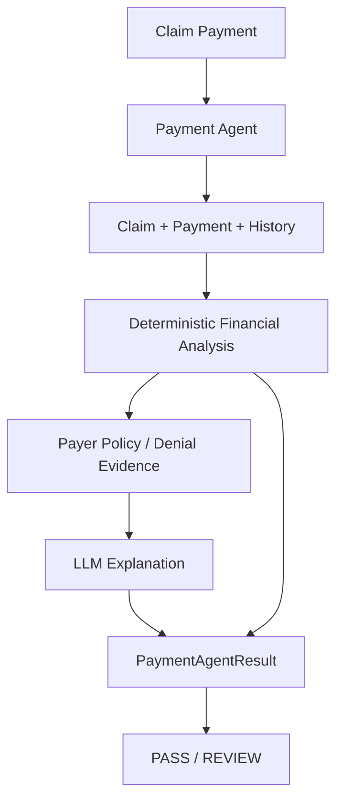

# Payment Specialist Agent

The Payment Specialist Agent analyzes synthetic post-adjudication payment information. It reports what the available records show financially and identifies cases needing human review. It does not post payments, change claims, change patient responsibility, rebill, contact payers, submit appeals, or promise reimbursement.



## Interface and dependencies

```python
PaymentAgent().run(payment_id)
PaymentAgent().analyze_payment(payment)
```

The agent supports injected claim lookup, payment lookup, claim history lookup, payer policy lookup, optional Denial Agent, optional Rules Engine, LLM service, and audit sink. Unit tests use plain synthetic dictionaries and fakes, so no PostgreSQL, Docker, network, API key, payer API, clearinghouse, or eClinicalWorks integration is required.

## Deterministic financial calculations

- Billed amount comes from the related claim's `claim_amount`.
- `unpaid_balance = billed_amount - paid_amount - adjustment_amount` when all values exist.
- `payment_ratio = paid_amount / allowed_amount` only when `allowed_amount > 0`.
- Decimal values are used for monetary arithmetic.
- Missing values are reported explicitly and never invented.
- Reconciliation compares unpaid balance with recorded patient responsibility; mismatches are review findings.

The agent does not assume that an allowed amount is an expected contractual payment. Underpayment and overpayment are classified only when an explicit synthetic `payment_benchmark` exists in the payer policy. Current demo payer policies do not define that benchmark, so no contractual conclusion is made.

## Payment classifications

- `PAID`: paid amount exists and the deterministic unpaid balance is zero.
- `PARTIAL_PAYMENT`: paid amount exists and a positive unpaid balance remains.
- `ZERO_PAYMENT`: a record exists with paid amount zero.
- `UNDERPAYMENT` / `OVERPAYMENT`: only with an explicit configured benchmark.
- `NO_PAYMENT_RECORDED`: the lookup explicitly returns no payment record.
- `PAYMENT_DATA_INCOMPLETE`: required financial data is missing.
- `UNKNOWN`: values are contradictory or insufficient for another classification.

`PASS` means the available payment data was analyzed without unresolved review conditions. It does not mean the payment is contractually correct, that a payer owes money, or that a claim should be paid. Partial, zero, incomplete, unknown, benchmark-based discrepancy, reconciliation, and unknown-policy cases require `REVIEW`.

## Adjustments and evidence

Adjustment classifications distinguish no adjustment, contractual adjustment when the recorded components reconcile, patient responsibility, missing adjustment data, and unreconciled amounts. Every material finding includes a source such as `payment_record`, `claim_record`, `claim_history`, `payer_policy`, `denial_agent`, or `rules_engine`.

Denial Agent output is preserved as supporting evidence and is never overridden. Rules Engine output is also preserved as context; Payment Agent does not duplicate complete claim validation.

## LLM boundary

The LLM receives deterministic amounts, classifications, reconciliation findings, policy evidence, denial evidence, and history summaries. It may explain those facts and draft recommendations. It cannot change financial amounts or classifications, invent payer benchmarks or contractual terms, override denial or Rules Engine evidence, determine patient responsibility, or modify records. Deterministic values remain authoritative even when an LLM response disagrees.

## Human review and audit

Human review is required for every `REVIEW` result, including missing data, zero payment, partial balance, reconciliation conflict, unknown policy, potential benchmark discrepancy, denial/payment conflict, and any recommendation that could alter financial responsibility.

Audit events include:

- `payment_check_started`
- `payment_loaded`
- `payment_amounts_calculated`
- `payment_reconciliation_completed`
- `payment_policy_checked`
- `payment_history_checked`
- `payment_denial_evidence_collected`
- `payment_root_cause_analyzed`
- `payment_llm_reasoning` when used
- `payment_result_generated`

Audit details contain payment ID, status, and synthetic source only. They do not contain secrets, API keys, full patient records, or unnecessary member IDs.

## Limitations

This portfolio project uses synthetic/demo healthcare data only. It does not claim real payer behavior, payment correctness, contractual liability, production billing accuracy, or HIPAA compliance. Production deployment would require appropriate security, privacy, authorization, auditability, financial controls, validated integrations, authoritative payer contracts, and qualified human review.
