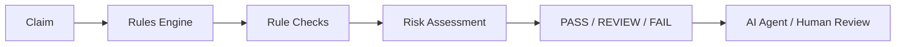

# Deterministic RCM Rules Engine

The rules engine provides a transparent validation layer for synthetic claims before later automation or AI-assisted workflows. It does not call an LLM, external eligibility service, or payer system, and it does not make clinical coding judgments.

## Rule categories

- Required claim fields
- Positive claim amount
- Presence of ICD and CPT codes
- Configurable modifier requirements
- Service date validity
- Synthetic payer policy availability and requirements
- Timely filing
- Duplicate claim detection
- Optional eligibility results

Payer policies are loaded from `data/payer_policies.json`; the engine does not invent policy values. Unknown payers produce a `REVIEW` result because deterministic policy validation is unavailable.

## Risk scoring

Each issue contributes a fixed score based on severity:

- `CRITICAL`: 40
- `HIGH`: 25
- `MEDIUM`: 15
- `LOW`: 5

The total is capped at 100. The score is deterministic and independent of an LLM.

## Overall status

- `FAIL`: critical validation failure or missing essential claim data
- `REVIEW`: duplicate risk, eligibility problem, unknown payer, or other unresolved issue
- `PASS`: all enabled deterministic checks pass

A high-severity issue normally produces `REVIEW` unless it is an essential required-field or amount/code failure, which produces `FAIL`.

## Future consumers

Later AI agents may consume this structured result to prioritize work, draft explanations, or request human approval. They should not override the deterministic result without an explicit human-controlled workflow.

LLMs should not independently control deterministic billing validation because their outputs are probabilistic, difficult to audit, and not a substitute for explicit payer policy or required-field checks.

